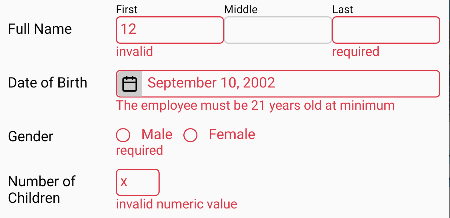
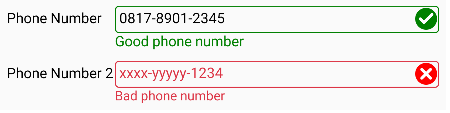
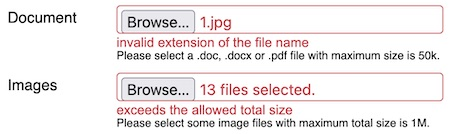

# Documentation

It's common in an application that the user needs to fill the inputs or choose the options.
There are some components that becomes the interface for user to make an input such as text
box, radio button, check box, combo box etc. Sometimes, the user inputs needs validation
before being saved into database or continuing to the next process to make the application
works correctly.

This package is to validate the input component and if the input value is invalid then an
error message will be shown near the input component. If the value is valid, optionally, the
clue that tells the value is valid can also be shown. The following picture below depicts some
examples how the error messages are displayed.



More fancy example which uses an icon to reflect the validation status:



It can also validate the uploaded files:




## How To Install

    npm i rc-input-validator --legacy-peer-deps


## The Comparison between `rc-input-validator` and The Other System

Here, we explain the comparison with the other package or even the *built-in* validation stuff
in HTML DOM (Document Object Model). Not trying to compete those systems but
`rc-input-validator` tries to fill the untouched gap.

### Schema-based validator
This kind of validator is quite popular. Therefore, we talk about it here. The example of this
kind of validator are [`zod`](https://zod.dev/) and [`ajv`](https://ajv.js.org/). These
validators can validate a simple data up to a complex nested object. Whereas, in the other
hand, `rc-input-validator` can only validate the simple values. It's because this package is
designed to validate the inputs inside the form that will be submitted to the server. In fact,
the form inputs retain the simple value, mostly a string or an array of string.

Another fact, the object of *schema* validator is the data itself. Whereas, the object of
`rc-input-validator` is the input components (the User Interface widget/control) which is
indirectly the data retained by the input components. So, what is the different?
`rc-input-validator` can show the error message near the invalid input component and change
their styling (appearance) whether they are invalid or valid.

Actually, `rc-input-validator` can also to validate the data directly. But it's likely you
prefer to use schema-based validator for web API service.

### *Built-in* HTML DOM (Document Object Model) validation stuff
The recent HTML DOM is equipped with a lot of stuff for the form inputs validation. I think,
for basic to intermediate needs, it's enough for you. Even you don't need write any script
because the form inputs are automatically validated just before submitted. If any invalid
input, the form won't be submitted.

You may set the validation via attributes: `required`, `pattern`, `min`, `max`, `minlength`,
`maxlength` etc. Some values for `type` attribute are also available for some special input
data type, such as `date`, `time`, `number`, `url` etc. If the value entered by user is not in
a proper format for those special data types, the input will be considered as invalid. When
the validation event happens, an error message will be shown according to what constraint has
been violated. In addition, you may set a custom message by invoking `setCustomValidity`
method (in this case, you must write a script).

For input styling, there are some CSS pseudo classes that can be used. You may use `:invalid`
or `:valid`. Also, `:required` may be useful.

Now, we talk about the conditions in which you may prefer `rc-input-validator`
> These conditions happen, at least on all browsers I've known (Edge, Chrome, Firefox, Safari) 
- *Built-in* validation only shows the error message for the first invalid input. So, if there
  are some invalid inputs, you must fix one input and then click submit button repetitively
  until all inputs fixed. In contrast, `rc-input-validator` can show the error messages for
  all inputs at one click.
- *Built-in* validation shows the error message as a toast popup. In other hand,
  `rc-input-validator` shows it as a reqular text. Technically. it's a regular HTML element.
  Therefore, CSS applies to it. So, by using CSS, you can customize how the error message
  looks like, including like a toast popup.
- *Built-in* validation cannot set the priority of which rule should be evaluated first. For
  example, for the following input:   
  `<input type='text' name='text' required pattern='[a-z]+' minLength={3} />`  
  On Gecko browser, `minLength` is evaluated first and then `pattern`. On Webkit browser,
  the first is `pattern`. All upto the browser, which rule is evaluated first. By using
  `rc-input-validator`, we can set which rule is evaluated first. It's set by the 
  [`priority`](#validationrule_property-priority) property and the order in `rules` array.
- We cannot set a language other than English for the error messages. Perhaps,
  `setCustomValidity` may help.
- `rc-input-validator` offers more advanced validation rules, even you can create your own
  rule.


## **A Brief Example** <a name="brief_example"></a>

### React Native App <a name="brief_example-native"></a>
```javascript
import React from 'react';
import {
    Button,
    StyleSheet,
    Text,
    TextInput,
    View,
} from 'react-native';
import {
    ValidationContext,
    withValidation,
} from "rc-input-validator/native";
import {
    email,
    required,
} from 'rc-input-validator/rules';
import server from './server';

const UserName = withValidation(TextInput, {
    rules: [email, required],
});
const Password = withValidation(TextInput, {
    rules: required,
});

export default function LoginForm() {
    const validationRef = React.createRef();
    const [userName, setUserName] = React.useState('');
    const [password, setPassword] = React.useState('');
    
    return (
        <ValidationContext ref={validationRef}>
            <Text style={styles.title}>Please login:</Text>
            <UserName autoCorrect={false} onChangeText={setUserName} placeholder="Email" style={styles.input} value={userName} />
            <Password onChangeText={setPassword} placeholder="Password" secureTextEntry style={styles.input} value={password} />
            <View style={styles.buttonRow}>
                <Button
                    onPress={() => {
                        if (validationRef.current?.validate()) {
                            server.login(userName, password);
                        }
                    }}
                    title="Login"
                />
            </View>
        </ValidationContext>
    );
}

const styles = StyleSheet.create({
    buttonRow: {
        flexDirection: 'row',
        justifyContent: 'flex-end',
    },
    input: {
        borderColor: '#ccc',
        borderRadius: 4,
        borderWidth: 1,
        color: 'black',
        marginBottom: 10,
    },
    title: {
        marginBottom: 10,
    },
});
```
In this example, you may concern to `withValidation` and `ValidationContext` most. At a glance,
you may have concluded that `withValidation` is to specify the validation rules for the input
and `ValidationContext` is to validate all inputs inside it. Actually, each input can be
validated individually and doesn't need to be put inside `ValidationContext` (see detailly
[here](#withvalidation_method-validate)). `ValidationContext` exists to validate many inputs
at once.

### React Web App <a name="brief_example-web"></a>
```javascript
import React from 'react';
import {
    Form,
    Input,
} from "rc-input-validator/web";
import {
    email,
    required,
} from 'rc-input-validator/rules';

export default function LoginForm() {
    return (
        <Form action='/login' method='POST'>
            <h3>Please login:</h3>
            <Input rules={[email, required]} type='text' name='usename' placeholder="Email" />
            <Input rules={required} type='password' name='password' placeholder="Password" />
            <div style={{display: 'flex', justifyContent: 'flex-end'}}>
                <button type='submit'>Login</button>
            </div>
        </Form>
    );
}
```
React web app looks more simple. There are `Form` and `Input` element. `Input` is replacement
of `withValidation` in React Native app. It extends the original `input` elenent. It adds
`rules` props to it. `Form` extends the original `form` element. It wraps `ValidationContext`
that should be placed next to `form` element. For detail explaination, please read
[`Form`](#form) and [`Input`](#web_input) section.


# **API Reference**

## Package Structure <a name="package_structure"></a>
This package consists of some modules as the entry points to access the objects provided by
this package. Generally, you must import the components for React Native app from "native"
module. The components for web app are imported from "web" module. The rule objects are from
"rules" module.

The more complete list below shows the modules and the objects exported from them:
- "rc-input-validator"
  + `AsyncFailMessage`
  + `isFilled`
  + `str`
- "rc-input-validator/native"
  + `isDifferentStyle`
  + `Validation`
  + `ValidationContext`
  + `withValidation`
  + type `StyleProp`
  + type `ValidationOption`
- "rc-input-validator/rules"
  + `alwaysValid`
  + `CustomRule`
  + `CustomRuleAsync`
  + `Email`
  + `email`
  + `HttpReq`
  + `httpReq`
  + `Integer`
  + `integer`
  + `Length`
  + `length`
  + `lengthMax`
  + `Max`
  + `max`
  + `Min`
  + `min`
  + `Numeric`
  + `numeric`
  + `Regex`
  + `regex`
  + `Required`
  + `required`
  + `rule`
  + `ruleAsync`
  + `ValidationRule`
  + `ValidationRuleAsync`
- "rc-input-validator/rules/date"
  + `date`
  + `StrDate`
- "rc-input-validator/rules/time"
  + `Time`
  + `time`
- "rc-input-validator/types"
  + type `ContextRef`
  + type `InputRef`
- "rc-input-validator/web"
  + `CheckBoxes`
  + `Form`
  + `getStyleProps`
  + `Input`
  + `isDifferentStyle`
  + `RadioButtons`
  + `Select`
  + `TextArea`
  + `ValidatedInput`
  + `Validation`
  + `ValidationContext`
  + type `CompositeStyleProp`
  + type `HtmlInputRef` (replacement for `HTMLInputElement`)
  + type `HtmlSelectRef` (replacement for `HTMLSelectElement`)
  + type `StyleProp`
  + type `ValidationOption`
- "rc-input-validator/web/rules"
  + `FileCheck`
  + `fileCheck`
  + `fileExt`
  + `fileMax`
  + `fileTotalMax`
  + `fileType`


## `ValidationContext` <a name="validationcontext"></a>
> For React Native, it's imported from `"rc-input-validator/native"`   
> For React web, it's imported from `"rc-input-validator/web"`

This element can validate all contained [`Input`, `TextArea`, `Select`](#web_input) or inputs
that have been set by [`withValidation`](#withvalidation). Also, it can clear the validation
status of those inputs.

> For web app, you may prefer [`Form`](#form)

<a name="validationcontext-properties"></a>Some props that can be set for this element are:

- `asyncFailMessage` <a name="validationcontext-asyncfailmessage"></a>  
  **Type:** enum: `AsyncFailMessage { Default, CaughtError }`  
  When executing [`validateAsync`](#withvalidation_method-validateasync) method, if it happens
  an error, this prop specify which error message should be displayed. By default, the
  displayed message is "cannot validate". But, if the prop value is
  `AsyncFailMessage.CaughtError` then the displayed message is taken from the message of the
  thrown error.  
  **Default:** `AsyncFailMessage.Default`

- `auto` <a name="validationcontext-auto"></a>  
  **Type:** `boolean`  
  If `true` then all inputs inside it will be validated automatically when the user
  types/changes the input value.  
  **Default:** `false`

- `Container` <a name="validationcontext-container"></a>  
  **Type:** `React.ComponentType<{style?: StyleProp, children?: React.ReactNode}>`  
  To make the input and the error message sticks together, both of them are contained inside a
  container element. This `Container` is to specify the container component. For web app, you
  may need [`getStyleProps`](#function-getStyleProps) to translate from `StyleProp` to
  `className` and `style` prop so that can be applied to the HTML element (Please read this
  [section](#style_handling-web) for additional information).
  
  If you feel this `Container` is unhandy because you use a CSS framework that can take care
  the layout, you can remove the `Container` element by following the example below:
  ```javascript
    function Container({children}) {
      return children;
    }
    <ValidationContext Container={Container}>

      {/* The input elements here */}

    </ValidationContext>
  ```
  Just need to note: the error message is placed after the input element. Also, if there is an
  icon element yielded by [`setStatusStyle`](#withvalidation-setstatusstyle), it will be
  placed between the input and the error message.   
  **Default:** For React Native, it's `View`. For web, it's a component which renders `div`.

- `ErrorText` <a name="validationcontext-errortext"></a>  
  **Type:**
  ```
  React.ComponentType<{
      style?: [
          StyleProp | undefined,
          StyleProp | undefined,
      ] | StyleProp,
      children?: React.ReactNode,
  }>
  ```
  It's the component that displays the error message. For web app, you may need
  [`getStyleProps`](#function-getStyleProps) to translate from `style` prop of this component
  to HTML `className` and `style` prop (Please read this [section](#style_handling-web) for
  additional information).  
  **Default:** For web, it's a component which renders `span`. `Text` for React Native.   
  It seems no other option in React Native. All static texts must be contained in `Text`
  element. But perhaps, you want to give some decorators to the error message, you can create
  a custom component and benefit this `ErrorText` prop.

- `errorTextStyle` <a name="validationcontext-errortextstyle"></a>   
  **Type:** the same as `style` prop. Please read [Style Handling](#style_handling).   
  The style for the error message when the input is invalid.  
  **Default:** sets red color to the text

- `focusOnInvalid` <a name="validationcontext-focusoninvalid"></a>  
  **Type:** `boolean`  
  If `true` then after validation, the first invalid input which has `focus` method will get
  the focus.  
  **Default:** `false`

- `inputErrorStyle` <a name="validationcontext-inputerrorstyle"></a>  
  **Type:** the same as `style` prop. Please read [Style Handling](#style_handling).   
  The style for the input when the input is invalid.  
  **Default:** sets red color to the border and text

- `lang` <a name="validationcontext-lang"></a>  
  **Type:** `function(string): string`  
  This function is useful for the app whose multi language. This function is to translate the
  error messages which are in english to the active language. Read [this section](#messages)
  to inquire what messages need to translate.  
  **Default:** `s => s` (It means no translation)

#### <a name="validationcontext_members"></a>Methods and property of `ValidationContext` reference (the object that we get from `ref` prop):
- `clearValidation` <a name="validationcontext_method-clearvalidation"></a>   
  It executes [`clearValidation`](#withvalidation_method-clearvalidation) method of all
  contained inputs to clear the validation status of all contained inputs.

- `isValid`   
  is the property to check the validity status of all inputs inside the context. If there is
  an invalid input, this property  will have `false` value. Otherwise it's `true`. The value
  of this property is trusted after calling [`validate`](#validationcontext_method-validate)
  or [`validateAsync`](#validationcontext_method-validateasync).

- `getErrorMessage(name)`<a name="validationcontext_method-geterrormessage"></a>  
  returns the error message that is being displayed for the input whose the
  [name](#withvalidation-name) specified by `name` parameter and inside the current
  `ValidationContext`. It returns an empty string if no error message displayed for that input.
  It returns `undefined` if no input whose such `name`.

- `getInput(name)`<a name="validationcontext_method-getinput"></a>  
  returns the reference of the input whose the [name](#withvalidation-name) specified by
  `name` parameter and inside the current `ValidationContext`. It returns `undefined` if no
  input whose such `name`.

- `refreshMessage` <a name="validationcontext_method-refreshMessage"></a>   
  For a multi languange app, this method is useful to update the language of the error
  messages. This methods will re-validate all contained inputs so that their error messages
  are refreshed. Because of that, if the input is already valid then the error message will
  be gone.

- `setErrorMessage(name, message)`<a name="validationcontext_method-seterrormessage"></a>   
  This method is to set the error message for an input whose the [name](#withvalidation-name)
  specified by `name` parameter. `message` parameter is the error message to show. The input
  must be inside the current `ValidationContext`. This method is useful when dealing with
  [server-side validation](#server-side_validation).

- `validate` <a name="validationcontext_method-validate"></a>   
  It executes [`validate`](#withvalidation_method-validate) method of all contained inputs to
  validate all contained inputs. This method returns `false` if any invalid input and returns
  `true` otherwise.
  
- `validateAsync` <a name="validationcontext_method-validateasync"></a>   
  It executes [`validateAsync`](#withvalidation_method-validateasync) method of all contained
  inputs to validate them. This method returns a `Promise` object that will resolve to `false`
  if any invalid input or `true` if otherwise.

### `Form` <a name="form"></a>
In web app, `ValidationContext` should be placed next to `form` element to cover all inputs
that will be submitted to the server. Because of this, `Form` component exists to wrap both
components, `ValidationContext` and `form`. By using `onSubmit` event, `Form` component
arranges `ValidationContext` to execute validation. If any invalid input, the sumbit event
will be cancelled.

> Coupling `ValidationContext` and `form` element is not a must. If you have another purpose,
> you may place `ValidationContext` element wherever you want.

`Form` element has all props of `form` element, except `noValidate`. *Built-in* validation is
always disabled because `rc-input-validator` takes in charge now. Beside `form` props, there
is an additional prop:
- `contextProps` is an object containing
  [`ValidationContext` props](#validationcontext-properties). This object will be delegated as
  the props of the wrapped `ValidationContext`.

#### Methods and properties
`Form` component has all members of
[`ValidationContext`](#validationcontext_members) and also all members of 
[`form`](https://developer.mozilla.org/en-US/docs/Web/API/HTMLFormElement).


## Input Component <a name="input"></a>
An input that will be validated must be prepared, mainly, it must apply some validation rules.
An input can be validated individually or in a group. To validate a group of inputs, they must
be put in a [`ValidationContext`](#validationcontext).

For React Native app, an input is prepared by [`withValidation`](#withvalidation). For web app,
there are some [components](#web_input) that mimic the HTML input elements. Technically, they
prepare the represented HTML input element when mounted (prepared just once, not every
render/update) so that the input can be validated.

### Input validation options/settings <a name="withvalidation-option-properties"></a> 
To prepare an input, there are some option properties that can be set to determine the
behavior of validation. For React Native, these option properties are assigned to the second
parameter of [`withValidation`](#withvalidation) function. For web, these validation options
are assigned to [`settings`](#web_input-settings) prop of the input.

The list of input validation option properties:
- `asyncFailMessage` <a name="withvalidation-asyncfailmessage"></a>   
  **Type:** enum `AsyncFailMessage { Default, CaughtError }`  
  The purpose of this option is the same as
  [`asyncFailMessage`](#validationcontext-asyncfailmessage) for `ValidationContext`. If
  specified and inside a `ValidationContext`, it will override the specified one for
  `ValidationContext`.

- `auto` <a name="withvalidation-auto"></a>  
  **Type:** `boolean`  
  If `true` then the input will be validated automatically when the user types/changes the
  input value. If specified and inside a `ValidationContext`, it will override the specified
  [`auto`](#validationcontext-auto) for `ValidationContext`. This option is ignored (cannot
  use auto validation) when you set one or more [asynchronous rule](#validationruleasync) for
  [`rules`](#withvalidation-rules).

- `Container` <a name="withvalidation-container"></a>  
  It's the same as [`Container`](#validationcontext-container) prop of `ValidationContext`. If
  specified and inside a `ValidationContext`, it will override the specified `Container` for
  `ValidationContext`.

- `ErrorText` <a name="withvalidation-errortext"></a>  
  It's the same as [`ErrorText`](#validationcontext-errortext) prop of
  `ValidationContext`. If specified and inside a `ValidationContext`, it will override the
  specified `ErrorText` for `ValidationContext`.

- `errorTextStyle` <a name="withvalidation-errortextstyle"></a>  
  **Type:** the same as `style` prop. Please read [Style Handling](#style_handling).   
  The style for the error message when the input is invalid. If specified, it will overwrite
  the specified [`errorTextStyle`](#validationcontext-errortextstyle) for `ValidationContext`.

- `inputErrorStyle` <a name="withvalidation-inputerrorstyle"></a>  
  **Type:** the same as `style` prop. Please read [Style Handling](#style_handling).   
  The style for the input when the input is invalid. It overwrites
  [`inputErrorStyle`](#validationcontext-inputerrorstyle) of `ValidationContext`.

- `lang` <a name="withvalidation-lang"></a>  
  **Type:** `function(string): string`  
  It's the same as [`lang`](#validationcontext-lang) prop of `ValidationContext`. It's only
  used if the input is placed not inside `ValidationContext`. So, it won't override what is
  specified for `ValidationContext`. 

- `setStatusStyle` <a name="withvalidation-setstatusstyle"></a>  
  **Type:** `function(props, style, context): React.ReactNode`  
  This function is called when executing [`validate`](#withvalidation_method-validate). This
  function should change the input style to reflect the validation status (valid/invalid).
  This function also is executed in every render because the style is reverted to normal style
  by [`setStyle`](#withvalidation-setstyle) function. In which condition the function is
  executed, you can check the second parameter.  
  **Parameters:**
  + `props` is the props of input element. The prop you should care about is that which holds
    style value for the input, usually named `style`.
  + `style` is the style value that should be assigned to the input style prop. When invalid,
    this parameter is an array of two entries, the first is
    [`inputErrorStyle`](#validationcontext-inputerrorstyle) of `ValidationContext` and the
    second is [`inputErrorStyle`](#withvalidation-inputerrorstyle) option. You may ignore this
    value if you have your own way to set the style.  
      
    When the input is valid, this parameter has the falsy value. There are three possibilities
    of this falsy value:
    * `null` if valid when executing [`validate`](#withvalidation_method-validate). You may
      set a success style to the input such as decorating it with green border.
    * `undefined` if when executing
      [`clearValidation`](#withvalidation_method-clearvalidation). Because of being cleared,
      you should not set any status style (valid/invalid). The style should be reverted to
      normal.
    * `false` if when rendering process
  
    The better comprehension may you get from this
    [example](https://github.com/atmulyana/rc-input-validator/blob/main/example/native/StatusIconPage.js)
    and its counterpart for web app.
  
  + `context` is an object which has three members:
    * `clearValidation` is a method to ask to clear the validation status. The input style
      will be reverted to normal.
    * `flag` is a property to help you to save the state of style changes. It's to avoid
      unneeded repeated action. By default, its value is `0`. The value can be set to any data
      type. Please see this
      [example](https://github.com/atmulyana/rc-input-validator/blob/main/example/native/StatusIconPage.js)
      how to use it.
    * `normalStyle` is a read only property. It's the normal style, that is the original style
      before altered to invalid/valid style. It can be used to revert back the style or to be
      combined with the invalid/valid style. Because, the invalid/valid style is usually based
      on the normal style with different color.
  
  **Return Value:**  
  This function may return a `React.ReactNode`. The `React.ReactNode` may display an icon
  which represents invalid/valid status. The icon will placed between the input and the error
  message. But, by using absolute positioning, you can place the icon at the left/right side
  of the input. You can see in this
  [example](https://github.com/atmulyana/rc-input-validator/blob/main/example/native/StatusIconPage.js)
  or its counterpart for web app.  

  **Default:**  
  A function that will set the style based on the second parameter (`style` parameter) when
  invalid and set the style to be `context.normalStyle` when valid. To set the style, it calls
  [`setStyle`](#withvalidation-setstyle) without the third parameter.

Beside the properties above, below are some properties which are only available for
[`withValidation`](#withvalidation) (there is a note for each property why it doesn't exist
for web input):
- `getStyle` <a name="withvalidation-getstyle"></a>  
  **Type:** `function(props): StyleProp`  
  This function is to get the style specified for the input. The function will be given the
  `props` object of input as the parameter and it must return the value of a prop which
  defines the style. Usually, the prop name is `style`.

  If the input is a composite component, the returned value must be the style for the root
  element of input. For example, below is an input which consists of the composite component:
  ```javascript
  function PercentageInput({
      containerStyle,
      inputStyle,
      percentStyle,
      ...props
  }) {
      return <View
          style={[
              containerStyle,
              {flexDirection:'row'}
          ]}
      >
          <TextInput
              style={inputStyle}
              {...props}
          />
          <Text style={percentStyle}>%</Text>
      </View>
  }
  ```
  `getStyle` must return `containerStyle` for above input.  

  **Default:** `props => props.style`
  > For web inputs, `getStyle` always read from `style` prop

- `getValue` <a name="withvalidation-getvalue"></a>  
  **Type:** `function(props): any`   
  This function is to get the value of the input. The function will be given the `props`
  object of input as the parameter and it must return the value of a prop which stores the
  input value. You really have to specify this function if the input value is not stored in
  the prop named `value`. If not, the validation won't work.  
  **Default:** `props => props.value`
  > For web inputs, `getValue` always read from `value` prop

- `name` <a name="withvalidation-name"></a>   
  **Type:** `string`  
  The name for the input. It's useful if you want to show the name in the error message.
  Please read [Messages](#messages) section and [`str`](#function-str) function for more
  information. It's also used by some [methods](#validationcontext_members) of
  `ValidationContext`.
  > For web inputs, the name is determined by `name` prop of the input

- `rules` <a name="withvalidation-rules"></a>   
  **Type:** [rule](#rule) object or array of [rule](#rule) objects   
  It's the validation [rules](#rule) of how the input to be validated. You must specify it. If
  not, the input component will be unmodified (won't be validated).
  > For web inputs, this option property is replaced by
  > [`rules`](#web_input-rules) prop

- `setStyle` <a name="withvalidation-setstyle"></a>  
  **Type:** `function(props, style?: StyleProp | Array<StyleProp | undefined>, containerStyle?: {style?: StyleProp})`  
  This function is to set the style for the input (and/or its
  [`Container`](#withvalidation-container)). This function must be defined if the input style
  prop is named other than `style`. Beside that, this function may be a corrective action to
  fix the style because of how this package prepares the style (please read this
  [`section`](#style_handling-native) for more information).  
  **NOTE:** It's not the opposite of [`getStyle`](#withvalidation-getstyle) which expects the
  composite style of the input element and its [`Container`](#withvalidation-container).
  Whereas `setStyle`, on other hand, sets the style to the input directly.

  The first parameter is the input props. The second one is the style that should be applied
  to the input. The third parameter is useful if you want to modify the style for the
  [`Container`](#withvalidation-container) element. Because `setStyle` is invoked in every
  render, just make sure it won't mess up the layout/appearance when executed more than once.

  **Default:** `(props, style) => props.style = style`   
  > For web, it's always `(props, style) => Object.assign(props, getStyleProps(style))`

### `withValidation` <a name="withvalidation"></a>
This function is to create a *higher-order component* that wraps an input component so that it
can apply some validation rules and also some attributes needed to define the behavior. You
can see in the [example](#brief_example-native) above that this function takes two parameters.
The first parameter is the function/class component that will be validated.

The second parameter is the option object. The object has some
[properties](#withvalidation-option-properties) which specify validation rules and the other
attributes. The only property you must specify is `rules`. The other properties are optional.
If you only need to set the validation rule(s) for the input, the second parameter can be a
[rule](#rule) object or an array of [rule](#rule) objects.

This function is available for React Native app.

### Web input <a name="web_input"></a>
For web app, there some input components that is automatically validated. Some of these inputs
mimic the standard form inputs. These inputs generally have the same props/attributes as HTML
inputs. However, there are some differents:
- `defaultChecked` and `defaultValue` are dropped. A validated input is always a controlled
  input. Internally, the validated input maintains a state for the input value. It's needed
  because the validator needs to read from the `value` prop.
- Because it's internally contolled, when `value` prop is set, the input value doesn't stick
  to `value` prop (it may be changed later without changing `value` prop). However, we may
  still define a state for `value` prop and its appropriate `onChange` handler.
- `className` is dropped. CSS class name(s) is also assigned to `style` prop (Please read this
  [section](#style_handling-web) for additional information). It's because how
  `rc-input-validator` works (related to [`getStyle`](#withvalidation-getstyle)).
- New prop: `rules` <a name="web_input-rules"></a> defines the validation rules for the input.
  It can be a [rule](#rule) object or an array of [rule](#rule) objects. Even if this prop can
  be updated in every render, but usually it doesn't change. If it never changes and there is
  a [rule](#rule) object needs quite heavy process to create, it's better to create the rule
  object outside the function component or `render` method of class component so that it's not
  recreated in every render.
- New prop: `settings` <a name="web_input-settings"></a> is the validation option properties
  as explained in the above [section](#withvalidation-option-properties). This prop is only
  read at mounting and in the next renders, this prop is ignored.

The available input components:
#### `Input`, `Select` and `TextArea` <a name="standard_input"></a>
`Input`, `Select` and `TextArea` represents HTML `input`, `select` and `textarea` respectively.
They have the same props as ones owned by their represented HTML element except some notes
explained by above paragraph.

Data type of `value` prop of `Input` mostly is `string`. If `type` prop is `number` or `range`,
`value` data type is `number`. If `type` prop is `file`, don't you set `value` prop but if you
set `onChange` handler, `event.target.value` will be an array of `File`.

Data type of `value` prop of `Select` is `string` by default. If `multiple` prop is set,
`value` data type is an array of `string`.

#### `CheckBoxes` <a name="checkboxes"></a>
`CheckBoxes` is a group of some `<Input type='checkbox' />` whose the same `name` prop.
Sometimes, this input is preferred representation of `<Select multiple>` if there are only the
slight number of options. This conponent has the following props:
- `name` as `input`'s `name`
- `value` <a name="checkboxes-value"></a> as `input`'s `value`. Its data type is an array of
  string. It may be a `string` if only one selected.
- `horizontal` <a name="checkboxes-horizontal"></a> dertemines the layout of checkboxes. If
  it's `true`, the checkboxes will be laid horizontally. By default, the layout is vertical.
- `options` <a name="checkboxes-options"></a> is an array of object
  `{value: string, label?: string}` or a `string` array. `value` of an option is the `value`
  of the checkbox and its `label` is for the checkbox' label. If `label` is not defined then
  it's the same as `value`. If `options` is a `string` array then it means all `value` and its
  `label` are the same.  
  [`value`](#checkboxes-value) will be compared to `value` of each option to determine whether
  the corresponding checkbox is checked or not. Remember, this component is internally
  controlled, so, the selected checkbox(es) doesn't stick to [`value`](#checkboxes-value) prop
  and may be changed later without changing `value` prop. Still, you may define a state for
  `value` prop and its appropriate `onChange` handler.  
  `options` is a required props (must be set).
- Other common HTML element props and validation input [props](#web_input).

Available `CheckBoxes` method:
- `focus` <a name="checkboxes-focus"></a> is to give focus on the first checkbox.

Example:
```javascript
<CheckBoxes
  rules={alwaysValid}
  options={['Music', 'Movie', 'Sport', 'Other']}
  value={['Music', 'Movie']}
/>
```
The above example will show four checkboxes labeled as 'Music', 'Movie', 'Sport' and 'Other'
with 'Music' and 'Movie' are checked.

#### `RadioButtons`
`RadioButtons` is a group of some `<Input type='radio' />` whose the same `name` prop. In fact,
radio input should be in a group to make a choice. Sometimes, this input is preferred
representation of `<Select>` if there are only the slight number of options. This component
has props/method as the same as the props/method of [`CheckBoxes`](#checkboxes) except `value`
data type is always a `string`.

Example:
```javascript
<RadioButtons
  horizontal
  options={[
    {value: 'M', label: 'Male'},
    {value: 'F', label: 'Female'},
  ]}
  rules={required}
  value='M'
/>
```
The above example will show two radio buttons labeled as 'Male' and 'Female' with 'Male' is
checked.

#### `ValidatedInput`
If the above inputs are not enough, `ValidatedInput` gives you a freedom to define an input.
Beside [`rules`](#web_input-rules) and [`settings`](#web_input-settings) prop,
`ValidatedInput` has `Component` prop. The last prop is an input component. You can assign
your custom input component to this prop. The rest props (other than `rules`, `settings` and
`Component`) assigned to `ValidatedInput` element will be delegated to the input element
defined by `Component` prop.

`Component` prop is only read at mounting. In the next renders, this prop is ignored.

### Methods and properties of the input reference (the object that we get from `ref` prop): <a name="withvalidation_methods_property"></a>
- `clearValidation` <a name="withvalidation_method-clearvalidation"></a>   
  It's to clear validation status. The error message will disappear and the input style is
  reverted to normal. After executing this method,
  [`isValid`](#withvalidation_property-isvalid) will be reset to `true` even if the input is
  invalid. If [`auto`](#withvalidation-auto) validation is disabled, this method will be
  called when the user edits the input value right after the validation.

- `getErrorMessage` <a name="withvalidation_method-getErrorMessage"></a>   
  This method returns the error message being displayed for the input. It returns an empty
  string if no error.

- `isValid` <a name="withvalidation_property-isvalid"></a>  
  It shows the validity status of input. It's `true` if valid and `false` if invalid. The
  value of this property is trusted after calling
  [`validate`](#withvalidation_method-validate) or
  [`validateAsync`](#withvalidation_method-validateasync).

- `name` <a name="withvalidation_property-name"></a>  
  It's the name of input. The value of this property is the same as that specified for
  [`name`](#withvalidation-name) option or `name` prop of web input.

- `setErrorMessage(message)` <a name="withvalidation_method-seterrormessage"></a>  
  This method can set the error message for the input without calling
  [`validate`](#withvalidation_method-validate) or
  [`validateAsync`](#withvalidation_method-validateasync). It won't validate any
  [rule](#withvalidation-rules) that has been applied to the input. By calling this method,
  the input status becomes invalid ([`isValid`](#withvalidation_property-isvalid) property is
  `false`).

  For example, we need to validate the input on the server because we must read the database
  to make sure the inputed user name is unique. (NOTE: The example below should be solved
  using [asynchronous validation](#asynchronous_validation) interfaces).
  ```javascript
  const validateAsync = () => new Promise((resolve, reject) => {
      fetch(
          `https://yourserver.com/validate/unique-user-name?uname=${encodeURIComponent(userName)}`
      ).then(async (response) => {
          if (response.ok) return response.json();
          reject(await response.text());
      }).then(data => {
          if (data.userNameExists) {
              userNameInput.current?.setErrorMessage('The user name has been used');
              resolve(false);
          }
          else {
              resolve(true);
          }
      }).catch(err => {
          reject(err);
      });
  })
  .catch(err => {
      /*If there is a problem with the server, you may tell the user here or you may just keep it silent and
        try to re-validate it on the server when the form is submitted. In fact, backend validation is still
        needed all time to avoid tampered data.*/
      //userNameInput.current?.setErrorMessage('The server cannot validate');
  });
  <UserNameInput ref={userNameInput} onBlur={validateAsync} onChangeText={setUserName} value={userName} />
  ```

  Another example, when the validation process yields an error:
  ```javascript
  <UserNameInput ref={userNameInput} onChangeText={setUserName} value={userName}
     onBlur={() => {
        try {
            userNameInput.current.validate();
        }
        catch {
            userNameInput.current.setErrorMessage('An error happens when validating');
        }
     }}
  />
  ``` 

  Need to remember that [`rules`](#withvalidation-rules) option is required. If
  you want to use `setErrorMessage` method but doesn't need to apply any validation rule, you
  can use [`alwaysValid`](#alwaysvalid) rule.

- `validate` <a name="withvalidation_method-validate"></a>  
  This method is to validate the input based on the specified [rules](#withvalidation-rules).
  Below is the example how to validate input when it's lost focus. 

        <NameTextInput ref={nameInput} onBlur={() => nameInput.current?.validate()} onChangeText={setName} value={name} />

  This method returns `true` if input value is valid or `false` if invalid. This method will
  throw an error if there is a
  [rule object which does the asynchronous validation](#validationruleasync).

- `validateAsync` <a name="withvalidation_method-validateasync"></a>  
  As [`validate`](#withvalidation_method-validate), this method is also to validate the input
  based on the specified [rules](#withvalidation-rules) but the process is executed in
  asynchronous mode. This method returns a `Promise` object that will resolve to `true` if the
  input value is valid or `false` if otherwise.

If the original input has the same methods and property as listed above, they will be
overriden. If you want to access the overridden method/property of original input, follow the
example below:

    const inputRef = React.useRef();
    ...
    <Input ref={inputRef} onBlur={() => {
        //This statement will validate the input
        inputRef.current.validate();
        
        //This statement will invoke `validate` method of original input
        inputRef.current.__proto__.validate();
    }} ... />


## `Validation` Component <a name="validation"></a>
> For React Native, it's imported from `"rc-input-validator/native"`   
> For React web, it's imported from `"rc-input-validator/web"`

`Validation` component can be used to validate a value without wrapping an input component.
It has some properties which are the same as
`withValidion` [option](#withvalidation-option-properties). These properties are `auto`,
`errorTextStyle`, `lang` and `rules`. The purpose of these properties are exactly the same as
`withValidion` option's. These properties are *write-once*. They are only set when the
component is mounted. If you change the properties in the next render, it won't have effect.

Beside the properties mentioned before, there are two more properties:
- `style` is the style for [`Container`](#withvalidation-container) component rendered by
  `Validation` component. See [Style Handling](#style_handling) section, which style
  attributes that have effect.
- `value` is the validated value. It can be an actual value or a function. If it's a function
  then the function will be executed to get the real value. The fuction is useful to create a
  dynamic value.

`Validation` object reference also has the same methods and property as
[those](#withvalidation_methods_property) owned by input component reference resulted by
`withValidation`

**Example:**

    import React from 'react';
    import {... TextInput, ...} from 'react-native';
    import {Validation, ValidationContext} from "rc-input-validator/native";
    import {email, required} from 'rc-input-validator/rules';
    ...

    export default function Form() {
        ...
        const [emailAddress, setEmailAddress] = React.useState('');
        ...

        return (
            <ValidationContext ref={validation}>
                ...
                <TextInput onChangeText={setEmailAddress} placeholder="Email" value={emailAddress} />
                <Validation rules={[required, email]} value={emailAddress} />
                ...
            </ValidationContext>
        );
    }

You notice this example, the value of `Validation` is the same as the value of email
`TextInput`. By this way, it's like to apply the use of `withValidation` to the email
`TextInput`.


## Style Handling <a name="style_handling"></a>

### React Native <a name="style_handling-native"></a>
To make the input and the error message stick together, [`withValidation`](#withvalidation)
wraps them into a [`Container`](#withvalidation-container) component. However, we want the
component yielded by [`withValidation`](#withvalidation) behaves the same as the original
input except we add the validation feature to it. All properties for the input must apply for
the new component. Every property seems ok, we can just distribute them to the wrapped input.
Except one property we think it has a problem. That is the property which defines the style
for the input. Because now, the input is inside the `Container`. We must modify the style
property if we still want the same style as if the input is unwrapped. The big concern is all
style attributes dealing with layout. That is how the parent of input arranges the area for
input, before. Because now, the parent must arrange the `Container`. Therefore, the component
yielded by [`withValidation`](#withvalidation) will move all style attributes dealing with
layout to be the style attributes of `Container`. Then, the input must be set to fill the area
of `Container`.

We know, the value for `style` prop is not always a plain object or a falsy value but it can
be a recursive array. Therefore, the first step is to flatten it if it's an array. Fortunately,
React Native has provided `StyleSheet.flatten` function to do that. After getting a single
plain object, the following style attributes will be assigned to the `Container`:
- `alignSelf`
- `bottom`
- `display`
- `end`
- `flexGrow`
- `flexShrink`
- `flexBasis`
- `left`
- `margin`
- `marginBottom`
- `marginEnd`
- `marginHorizontal`
- `marginLeft`
- `marginRight`
- `marginStart`
- `marginTop`
- `marginVertical`
- `maxWidth`
- `minWidth`
- `position`
- `right`
- `start`
- `top`
- `transform`
- `width`
- `zIndex`

Some other attributes will be moved to the `Container` under a condition:
- `height`, `minHeight` and `maxHeight`, if having the percentage value.
- `flex`, if greater than 0.

To make sure the input fills the area of the `Container`, its `flex` attribute is set to 1 if
the `Container` has one of attributes: `height` (percentage), `flex` or `flexBasis`. But if
the input has `height` (number) attribute, the `flex` attribute won't be set.

There are two handlers you may define in `withValidtion` option which involves in this
modification of style. Those are [`getStyle`](#withvalidation-getstyle) and
[`setStyle`](#withvalidation-setstyle).

There is still a possibility that the layout will mess up when the error message comes up.
That possibility happens, especially when the parent of input (that becomes the parent of the
`Container`) lays its children horizontally (`flexDirection` is `row`). To avoid it, you
should set a fixed height (not percentage) for the input.

The process explained above is executed in every render. To increase performance, it must be
sure that the process is run only if the style value changes. To do that, the package has
`isDifferentStyle` function. You can import this function for your own purpose. This function
does more detailedly than a shallow compare. Let's explain in the example below:

    const style1 = {flex: 2},
          style2 = {flex: 3};
    isDifferentStyle(style1, style2); //return true
    isDifferentStyle(style1, [style1]); //return false
    isDifferentStyle([style1], [style1]); //return false
    isDifferentStyle([style1, style2], [style1, style2]); //return false
    isDifferentStyle([style1, style2], [style2, style1]); //return true
    isDifferentStyle(style1, [style2]); //return true
    isDifferentStyle([style1], [style1, style2]); //return true

So, the function simply just compares the entry in the array at the same index. The more
detailedly logic can be done to make sure that they are really different but it can cause a
more complicated process that won't help increasing performance.

To help increasing performance, you must also set the style value to a constant value, not
variable. For example:

    const styles = StyleSheet.create({
        input: {borderWidth: 1, ...},
        hightlight: {...},
    });
    const Input = withValidation(TextInput, ...);
    ...
    export default function Form(props) {
        ...
        return (
            ...
            //It's BAD example
            <Input style={{borderWidth: 1, ...}} ... />

            //It's good
            <Input style={styles.input} ... />

            //If you want to make a different style for
            //a condition, it's a good example
            <Input style={[
                styles.input,
                highlighted ? styles.hightlight : null,
            ]} ... />
            ...
        );
    }

### React Web <a name="style_handling-web"></a>
Firstly, this package was designed for React Native. But then, the writer thought that there
is a need to port the package for React web. There is a big obstacle to rewrite this package
to support web app that is the style handling. The style in web, which is called CSS
(Cascading Style Sheet) is very complicated. There are many *shorthand* CSS properties. A
*shorthand* CSS property represents some other specific properties. It's not simple process to
parse. Therefore, we use the different approach for React web, the style must be explicitly
set to the input and its [`Container`](#withvalidation-container).

Beside that, an element style is determined by a lot of *selectors*: tag/element name, the
existence or the value of a prop/attribute or even by the parent/ancestor element and the
sibiling elements. However, the are two main props to define the style: `className` and
`style`. This package will focus on those two props.

Based on the above explanation, we make the following approach. Let's say we define
`StyleProp` that is the data type for `style` prop of individual component (the input or its
[`Container`](#withvalidation-container)). A validated input that is a composite component
(the original input and its `Container`) has `style` prop whose type as follows:

    { $cover: StyleProp, $input?: StyleProp } | StyleProp

`$cover` is for `Container` and `$input` for the original input component. An alternative way
is we can assign a `StyleProp` value to `style` prop. It means we want to set the input only
and let `Container` uses the default style. `StyleProp` itself is defined as follows:

    string | CSSProperties | { $class: string, $style: CSSProperties }

If it's `string` then it's the CSS class name(s) (will be assigned to `className` prop of the
underlying HTML element). If it's `CSSProperties` then it's inline style (will be assigned to
`style` prop of underlying HTML element). If we want to set both, we use `{$class, $style}`.
This package provides [`getStyleProps`](#function-getStyleProps) function to convert
`StyleProp` or array of `StyleProp` to be `{className, style}` object. This function may be
useful if you want to implement [`setStatusStyle`](#withvalidation-setstatusstyle) function.


## Asynchronous Validation <a name="asynchronous_validation"></a>
In some cases, we need to execute the validation process in asynchronous mode. The prominent
example is when we need to call back the server to check the validity of input value. May be,
we need to check the database to ensure the input is valid or not. For making an HTTP request
purpose, this package has provided [`httpReq`](#httpreq) rule.

To make the process of validation in asynchronous mode, first thing you need is a rule object
that can validate a value asynchronously. This package has provided some rule objects that can
make the process asynchronously. One of them has been mentioned before, that is `httpReq`. The
another one is [`ruleAsync`](#ruleasync). If these rule objects don't satisfy you, create your
own rule class which inherits [`ValidationRuleAsync`](#validationruleasync) class.

After you defines the asynchronous rule(s), as usual, set the rule(s) to
[`rules`](#withvalidation-rules) option of [`withValidation`](#withvalidation) or
[`rules`](#web_input-rules) prop of the web input. You may mix asynchronous and synchronous
rules. [`priority`](#validationrule_property-priority) property still applies as appropriately
(an asynchronous rule won't be examined after a synchronous rule that has lower priority).

The last step, to validate the input(s) asynchronously, you must call
[`validateAsync`](#withvalidation_method-validateasync) method of the input reference or
[`validateAsync`](#validationcontext_method-validateasync) method of the context reference.
Both methods return a `Promise` object. So, if you want to get the validation result, you
should use the following statement:

    inputRef.validateAsync()
        .then(isValid => {
            //... rest of your code
        });

or

    let isValid = await inputRef.validateAsync();

The last statement must be inside an `async` function.


## Server-side Validation <a name="server-side_validation"></a>
`rc-input-validator` pakcage is to validate inputs in React Native app or an HTML form. In
other words, it's for client-side validation. By existence of client-side validation, we are
more confident to submit data to the server. However, is it enough? Absolutely not. A hacker
can make a request without using our app and use an invalid data. So, the server-side
validation is always needed exactly as if we are not using a rich user interface application
(like an oldish web app).

Then, you may think that if we use a rule like [`httReq`](#httpreq) then the server-side
validation has been done because the validation by this rule is examined on the server.
Unfortunately, it's not. We must validate the inputs right before they are used by the
corresponding business process. Clearly, the URI used by `httpReq` is different from that to
where the data is submitted. Knowing this fact, you may think that a rule like `httReq` is not
needed because there will be more round-trip. Yes, you are true but people always have
different preference and there may be a situation it's needed.

Now, if we agree that the server-side validation is needed then how to notify user if there
is one or more invalid inputs. You may use an alert dialog or a Toast popup. But, it may be
better if we show each error message below the corresponding input with hightlighting style
like this package does in client-side validation. It's possible by the favor of
[`setErrorMessage`](#validationcontext_method-seterrormessage) method. Follow the example
below. In the example, if there is one or more invalid inputs, the server returns status code
400 (Bad Request) and the response body is a JSON data key-ed by the invalid input
[name](#withvalidation-name)s. The value of each key is the error message for that input.
```javascript
    <Button
        onPress={() => {
            function okAction() {
                //The code to be executed when all inputs are valid ...
            }

            fetch('https://yourserver.com/check-password', {
                body: JSON.stringify({passord, confirmPassword}),
                method: 'POST',
                headers: {
                    'Content-Type': 'application/json'
                }
            })
            .then(async (response) => {
                if (response.ok) okAction();
                else if (response.status == 400) {
                    const errors = await response.json();
                    for (let inputName in errors) {
                        contextRef.current.setErrorMessage(inputName, errors[inputName]);
                    }
                    if (contextRef.current.isValid) {
                        //Although, the response status is invalid but no error message provided.
                        //Therefore, we consider all inputs are valid.
                        okAction();
                    }
                }
                else {
                    Alert.alert('Validation', 'Server response is not OK');
                }
            })
            .catch(() => {
                Alert.alert('Validation', 'An error happened.');
            })
        }}
        title="Validate on server"
    />
```

To keep consistency, the logic used for the server-side validation must be the same as that
used by client-side validation. If you use Node server, you may use `rc-input-validator`
pakcage. However, if without TypeScript, you should import the rule objects and the needed
fuctions from "dist" directory. For example:
```javascript
    const {
        validate
    } = require("rc-input-validator/dist/helpers");
    const {
        required,
        rule,
        length,
    } = require('rc-input-validator/dist/rules');
```
To validate an input, follow the example below:
```javascript
    const passwordRules = [
        required,
        length(8),
        rule(
            value => {
                return /[a-z]/.test(value) && /[A-Z]/.test(value) && /[0-9]/.test(value) && /[^a-zA-Z\d\s]/.test(value);
            },
            'The password must contain capital and non capital letter, number and non-alphanumeric characters'
        ),
    ];
    errMsg = validate(inputValue, passwordRules, inputName);
    if (typeof(errMsg) == 'string') {
        errors[inputName] = errMsg; //the error message is collected for the response data
    }
```

[Asynchronous validation](#asynchronous_validation) is still needed in server-side validation,
for example, if we need to connect to database to check the validity of input. Database
connection is usually in asynchronous mode.


## Functions <a name="functions"></a>

The functions here can be imported from the package.

### `getStyleProps(...styles)` <a name="function-getStyleProps"></a>
This function is provided by "web" module. This function converts `StyleProp` value as
described in this [section](#style_handling-web) to be a value whose type:

    {className: string | undefined, style: CSSProperties | undefined}

so that it can be assigned as the props of an HTML element. This function can more than one
parameter or an array:

    getStyleProps(style1, style2, ...)

The resulted value will have all CSS classes defined by all parameters. For inline style, if
there is the same CSS property from different parameter, the property value from the parameter
on the right will override the one from the parameter on the left.

### `isFilled(value)` <a name="function-isFilled"></a>
This function is used by [`required`](#required) rule to check whether a value is empty or not.
A value is considered as empty if it is `null`, `undefined`, a string only contains white
space(s) or an empty array. An array containing only one empty element is also considered
empty. This funtion returns `false` if `value` is empty.

### `str(template, valueMap)` <a name="function-str"></a>
This function is to construct a string from a template string and a map of values. In the
template string contains the placeholders for variables to be replaced by the real value. The
placeholder is in format `${variable_name}`. The real values is in `valueMap` parameter. For
example:

    str('${name} must be at least ${min}', {name: 'count', min: 5})

will return string `"count must be at least 5"`.


## Rule Object <a name="rule"></a>

Rule object defines how to validate the input value. For example whether it's required (cannot
be empty), must be a numeric value, must be minimum at a certain value etc. The rule object is
reponsible to check whether the input value meets the desired condition or not, to be valid.
Mostly, one rule object is responsible to check only one condition. However, we can combine
some rule objects so that the input value must meet some conditions to be valid. This is why
`withValidation` [rules](#withvalidation-rules) option can be a single rule
object or an array of rule objects.

This package has some [*built-in* rule](#builtin_rules) objects which are ready
to use. These rule objects are explained in the next sections. You can create your own rule
object by creating a class that extends [`ValidationRule`](#validationrule) or
[`ValidationRuleAsync`](#validationruleasync). Most rule objects are imported from
`'rc-input-validator/rules'`.

### `ValidationRule` <a name="validationrule"></a>

This is the base class for all rule objects. Therefore, all object rules must have all
properties and methods explained here. 

#### Properties: <a name="validationrule_properties"></a>
- `errorMessage` <a name="validationrule_property-errormessage"></a>  
  Read-only. The error message if the input is invalid. If you define a new rule class, you
  should override this property to return the default error message. The value of this
  property can be a template string that can include some properties of the defined rule
  object. For example: `"${name} is invalid. ${value} is not valid phone number"`.

- `isValid` <a name="validationrule_property-isvalid"></a>  
  It's `true` if valid and `false` if invalid. It's set by
  [`validate`](#validationrule_method-validate) method. Therefore, it's trusted just after
  calling [`validate`](#validationrule_method-validate) method.

- `lang`  
   is a function to translate the error message to the active languange. By default, the
   message is in english. It will be set by [`validate`](#withvalidation_method-validate)
   method of input ref that will be the same as context [`lang`](#validationcontext-lang) or
   `widthValidation` [`lang`](#withvalidation-lang) option.

- `messageFunc` <a name="validationrule_property-messagefunc"></a>  
  Read-only. It's a function which returns the error message. This error message overwrites
  the default message specified by [`errorMessage`](#validationrule_property-errormessage).
  The parameter of the function is the rule object itself. To set this property, use
  [`setMessageFunc`](#validationrule_method-setmessagefunc) method.

- `name` <a name="validationrule_property-name"></a>  
  is the name of validated input. It's set by [`validate`](#withvalidation_method-validate)
  method of input ref which is the same as `withValidation` [`name`](#withvalidation-name)
  option or `name` prop of the web input.

- `priority` <a name="validationrule_property-priority"></a>  
  Read-only. If we specify some rules to validate the input, `priority` determines which rule
  to be examined first. `priority` has a number value. The lower value means the higher
  priority. By existence of `priority`, you don't need to bother the order in
  [`rules`](#withvalidation-rules) array of `withValidation` option or
  [`rules`](#web_input-rules) prop of the web input. The value of this property is set by
  [`setPriority`](#validationrule_method-setpriority).

  By default, the *built-in* rules have the priority as following (ordered based on which is
  examined first):
  + `required`, `required.if` (the priority cannot be changed, always the highest)
  + `date`, `email`, `length`, `lengthMax`, `numeric`, `time`
  + `integer`
  + `max`, `min`
  + `regex`
  + `rule`
  + `httpReq`, `ruleAsync`

  If two rules have the same priority, the order in the [`rules`](#withvalidation-rules) array
  determines which one first.

- `value` <a name="validationrule_property-value"></a>  
  is the input value that is validated. It's set by
  [`validate`](#withvalidation_method-validate) method of input ref.

- `resultValue` <a name="validationrule_property-resultValue"></a>  
  After calling [`validate`](#validationrule_method-validate), `resultValue` will save a value
  with valid data type. For example, for `numeric` rule, it will save a number value, not
  string like [`value`](#validationrule_property-value). The value of this prop is the value
  that will be axamined by the next rule. So, the original input value is only examined by the
  first rule.
  
  By default, `resultValue` is the same as [`value`](#validationrule_property-value) (with the
  same data type).

#### Methods: <a name="validationrule_methods"></a>
All methods returns the instance of the rule object.
- `setErrorMessage(message)` <a name="validationrule_method-seterrormessage"></a>  
  is to set [`messageFunc`](#validationrule_property-messagefunc) property to be
  `() => message`. It doesn't set [`errorMessage`](#validationrule_property-errormessage)
  directly because this property internally will checks
  [`messageFunc`](#validationrule_property-messagefunc) function whether it's defined. If
  defined, it will invokes the funtion instead. So, `setErrorMessage` is only the simpler
  alternative of [`setMessageFunc`](#validationrule_method-setmessagefunc).

- `setMessageFunc` <a name="validationrule_method-setmessagefunc"></a>  
  is to set [`messageFunc`](#validationrule_property-messagefunc) property.

- `setName` <a name="validationrule_method-setname"></a>  
  is to set [`name`](#validationrule_property-name) property.

- `setPriority` <a name="validationrule_method-setpriority"></a>  
  is to set [`priority`](#validationrule_property-priority). You should set a non-negative
  number.

- `setValue` <a name="validationrule_method-setvalue"></a>  
  is to set [`value`](#validationrule_property-value) property.

- `validate` <a name="validationrule_method-validate"></a>  
  is to validate [`value`](#validationrule_property-value) and then set
  [`isValid`](#validationrule_property-isvalid) based on the validity of
  [`value`](#validationrule_property-value).

You may ask why there are some `set*` method, why don't leave *read-write* property alone. It
is to make *fluent interface* which is more convenient. For example, when you set rule for
`withValidation` [`rules`](#withvalidation-rules) option:

    const Input = withValidation(..., {
        ...
        rules: [
            numeric,
            integer,
            min(0).setPriority(5),
            max(4).setMessageFunc(() => 'Too many'),
        ],
        ...
    });

or in unit test:

    expect(email.setValue('abc').validate().isValid).toBe(false);

#### Example: <a name="validationrule_example"></a>
An example class which you may create to validate a credit card number:
```javascript
import {ValidationRule} from 'rc-validator/rules';
const validator = require("card-validator");

export class CreditCardNumber extends ValidationRule {
    contructor() {
        super();
        this.setPriority(0); //0 is default, but here if you want to set the priority
    }

    get errorMessage() {
        return this.lang('invalid credit card number');
    }

    validate() {
        this.isValid = validator.number(this.value).isValid;
        return this;
    }
}

export const ccNumber = new CreditCardNumber(); //`ccNumber` is more convienent to write than `new CreditCardNumber()`
```

### `ValidationRuleAsync` <a name="validationruleasync"></a>

All rule objects which do validation in asynchronous mode, should inherit this class. This
class has all methods and properties as owned by
[`ValidationRule`](#validationrule) except the `validate` method of this class return a
`Promise` object. For example, we have to validate a credit card number input like in
[`ValidationRule` example](#validationrule_example). But here, we have a list of valid card
numbers in database. So, it must make an HTTP request to ask server to validate the number.
We change `validate` method in the example before to be:
```javascript
    async validate() {
        this.isValid = await fetch(
            `https://wwww.yourserver.com/check-cc-number?number=${encodeURIComponent(this.value)}`
        ).then(response => {
            //If card number has been registered in database, server returns HTTP status code 200 (OK)
            //If not, server returns 404 (Not Found)
            return response.ok;
        });
        return this;
    }
```

### *Built-in* Rules <a name="builtin_rules"></a>

#### `new StrDate(pattern, locale, isNet)` or `date(pattern, locale, isNet)` <a name="date"></a>
> You can import these rules from `'rc-input-validator/rules/date'`

This rule is to check the input value whether it's a valid date value. The input value is a
`string`. The [`resultValue`](#validationrule_property-resultValue) is a `Date` object.  
**Parameters:** <a name="date_parameters"></a>
- `pattern` is the valid pattern for the input string. The pattern is explained
  [here](https://atmulyana.github.io/JsSimpleDateFormat/JsSimpleDateFormat-Manual.html#Date_and_Time_Patterns).
  If you read the pattern documentation, the pattern may also include time. Indeed, this rule
  may validate the time along with the date. The default pattern is "yyyy-MM-dd".
- `locale` is the locale for the input string. The default is "en".
- `isNet` determines whether to use *Java-compatible* or *.NET-compatible* pattern. The
  default is `false` (uses *Java-compatible* pattern).

**Property:**
- `valueAsDate` is to get the `Date` object which reflects the current
  [`value`](#validationrule_property-value). It returns `null` if `value` is invalid. This
  property doesn't execute [`validate`](#validationrule_method-validate) method. Therefore,
  accessing this property won't change [`resultValue`](#validationrule_property-resultValue).

**Method:**
- `parse(strDate)` is to parse a string value to be a `Date` object using the defined
  [pattern](#date_parameters) for this rule. This method is useful to determine the constraint
  for the next rule such as [`max`](#max) or [`min`](#min).

> If you use `<input type="date" />` for the date input in web app, need to know that this
> input will have an empty string value if the input value is invalid (not the same as the
> displayed value). Therefore, it will be invalidated by [`required`](#required) rule or if
> not required, the input value will be valid (because of optional). To avoid this problem,
> follow the example below:
> ```
> const rules = [new Required().setErrorMessage('Invalid date'), date(), ...];
> function DateForm() {
>   return <Form ...>
>      ...
>      <Input type="date" rules={rules}  ... />
>      ...
>   </Form> 
> }
>```
> `Required` rule seems enough if you want only to check the date value is valid or not.
> `date` rule is still needed if you want to check the value using more rules, such as
> [`min`](#min) or [`max`](#max) because `date` rule will have
> [`resultValue`](#validationrule_property-resultValue) as a `Date` object.

#### `new Email()` or `email` <a name="email"></a>
The rule for examined the input value whether it's a valid email address or not.

#### `new HttpReq(uri, option)` or `httpReq(uri, option)` <a name="httpreq"></a>
This rule will make an HTTP request to validate the value. The validation is executed in
asynchronous mode.  
**Parameters:** <a name="httpreq_parameters"></a>
- `uri` is the URI string for HTTP request. This parameter is required.
- `option` defines the settings for HTTP request. This parameter is optional. `option` is a
  plain object whose one or more properties listed below (all properties are optional):
  + `data` is request data that will be sent to server. `data` can be a plain object or a
    `URLSearchParams` object. If `data` is set then the request will use POST method.
    [`name`](#validationrule_property-name) and [`value`](#validationrule_property-value) will
    be automatically included in `data` (you doesn't need to set them in `data`).   
    If `data` is not set then the request will use GET method.
    [`name`](#validationrule_property-name) and [`value`](#validationrule_property-value) will
    be inserted into URI string as the query part. If you want to use POST method but have no
    data other than [`name`](#validationrule_property-name) and
    [`value`](#validationrule_property-value), set `data` as an empty object (`{}`) or as
    `new URLSearchParams()` without setting any data.
  + `headers` is a plain object contains request HTTP headers. The keys of object are the
     header names and their values are their corresponding header values. For example:

        httpReq(
            'https://www.yourserver.com/checkdata',
            {
                headers: {
                    { Authorization: `Bearer ${publicKey}` },
                    {'X-Requested-With': 'MyApp'}
                }
            }
        )

  + `silentOnFailure` if it's `true` then there won't be any error message if a problem
    happens to the server response. The problems that can happen are timeout, response code is
    not ok etc. The input value is also considered valid. You must revalidate the input value
    on the server. In fact, backend validation on the server is still needed all time to avoid
    tampered data. By default, `silentOnFailure` is `false` (there will be an error message if
    a problem happens).
  + `timeout` defines the connection timeout in milliseconds. The default value is 0 (no
    timeout).

The server script that handles the request made by this rule object must return a boolean
value (`true` is valid or `false` is invalid) or a string of the error message. For example, if
using node express, the code would look like the following one:
```javascript
app.get('/check-validity', function(req, res) {
    const validity = validate(req.query.value); //suppose the function returns object: {isValid: boolean, errorMessage: string}
    let responseText;
    if (validity.isValid) responseText = JSON.stringify(true); //or just "true"
    else {
        if (validity.errorMessage) responseText = JSON.stringify(validity.errorMessage);
        else responseText = JSON.stringify(false); //or just "false"
    }
    res.send(responseText);
});
```

#### `new Integer()` or `integer` <a name="integer"></a>
Checks if the input value is integer or not. If the input value is a string (such as getting
from `TextInput`) and you want it considered as number, you must also specify
[`numeric`](#numeric) rule for the input. The `numeric` rule must have higher
[`priority`](#validationrule_property-priority) (default).

#### `new Length(minValue, maxValue)` or `length(minValue, maxValue)` or `lengthMax(maxValue)` <a name="length"></a>
This rule is to check a value which has `length` attribute such as a string or array. A number
can also be checked by this rule that is to check the digit count. A value is valid if its
length is not out of range. The minimum length is specified by `minValue` parameter and the
maximum length is specified by `maxValue` parameter. If `minValue` is undefined then the
minimum length is 0. If `maxValue` is undefined then no limit for maximum length.  
**Properties:**
- `max` is the maximum length (the same as `maxValue` parameter of constructor)
- `min` is the minimum length (the same as `minValue` parameter of constructor)

#### `new Max(maxValue)` or `max(maxValue)` <a name="max"></a>
To limit the input value at maximum of `maxValue`. The data type of `maxValue` can be string,
number or `Date`. If `maxValue` is number but the input value is string (such as getting from
`TextInput`) then you must also specify [`numeric`](#numeric) rule for the input. The
`numeric` rule must have higher [`priority`](#validationrule_property-priority) (default).  
**Property:**
- `max` is the maximum value (the same as `maxValue` parameter of constructor)

#### `new Min(minValue)` or `min(minValue)` <a name="min"></a>
To limit the input value at minimum of `minValue`. The data type of `minValue` can be string,
number or `Date`. If `minValue` is number but the input value is string (such as getting from
`TextInput`) then you must also specify [`numeric`](#numeric) rule for the input. The
`numeric` rule must have higher [`priority`](#validationrule_property-priority) (default).  
**Property:**
- `min` is the minimum value (the same as `minValue` parameter of constructor)

#### `new Numeric()` or `numeric` <a name="numeric"></a>
To assess if the input value is numeric or not.

#### `new Regex(pattern, flags)` or `regex(pattern, flags)` <a name="regex"></a>
To examine if `pattern` applies to the input value. `pattern` can be a `RegExp` object or a
pattern string. If `pattern` is a string, `flags` parameter is the flags to add to the pattern
(see
[this doc](https://developer.mozilla.org/en-US/docs/Web/JavaScript/Reference/Global_Objects/RegExp/RegExp)
for more information).

#### `new Required()` or `required` <a name="required"></a>
It's to specify the input value cannot be empty. This rule is the highest priority, examined
at the first time. If this rule is not specified then the input is optional. If optional then
when the input is not filled, it's assessed as valid, the other rules that has been specified
won't be examined.  
**Method:**
- `notTrimmed`  
  If the input value is a `string` then it will be trimmed before checked.
  [`resultValue`](#validationrule_property-resultValue) will have the trimmed
  value. If we want `resultValue` to have the original value, use the following statement:

      new Required().notTrimmed()

#### `Required.If(predicate)` or `required.if(predicate)` <a name="required.if"></a>
It's the same as [`required`](#required) rule but under a condition. The `predicate` parameter
is a function. If it returns `true` then the input is required. Otherwise, it's optional. The
parameter for `predicate` function is the input value.

#### `Required.If(() => false)` or `alwaysValid` <a name="alwaysvalid"></a>
Use this rule if you want to only use
[`setErrorMessage`](#withvalidation_method-seterrormessage) method without applying any other
rules.

#### `new CustomRule(predicate, errorMessage)` or `rule(predicate, errorMessage)` <a name="customrule"></a>
If you need more complicated logic to assess whether the input value is valid or invalid, this
rule fits for it. The `predicate` parameter is a function to asses the input value. The
parameter of this function is the input value. The `predicate` function may return `boolean`
(`true` is valid, `false` is invalid) or a string. If it returns a string then the input is
considered as invalid. The returned string is the error message (by this way, you may create
different error message for different condition). The `errorMessage` parameter is used as the
error message if `predicate` function doesn't return a string (returns `false`). If you set
[`messageFunc`](#validationrule_property-messagefunc) then the error message will be taken
from `messageFunc`.  
**Example:** <a name="rule_example"></a>  
The example below is the validator to check whether the number is between 5 to 9. If not then
the value is invalid. If the value is not a number then it return the error message "Not valid
number". If the value less than 5 then the message is "The value is too small". If the value
is higher than 9 then the message is "The value is too big".
```javascript
rule(
    value => {
        const numb = parseFloat(value);
        if (isNaN(numb)) { //Needs more checking to ensure the `value` is really a number
            return false;
        }
        else if (numb < 5) {
            return 'The value is too small';
        }
        else if (numb > 9) {
            return 'The value is too big';
        }
        return true;
    },
    'Not valid number'
)
```

#### `new CustomRuleAsync(predicate, errorMessage)` or `ruleAsync(predicate, errorMessage)` <a name="ruleasync"></a>
It is almost the same as [`rule`](#customrule) rule. The difference is it runs in asynchronous
mode. The `predicate` function for this rule doesn't return anything. As a replacement, to set
the validation status (valid/invalid or the error message), it has a second parameter which is
a function. The validation status is set using this function.  
**Example:** <a name="ruleasync_example"></a>   
As an example, we change [the example for `rule`](#rule_example) to be an appropriate one for
`ruleAsync`.
```javascript
ruleAsync(
    (value, resolve) => {
        const numb = parseFloat(value);
        if (isNaN(numb)) { //Needs more checking to ensure the `value` is really a number
            resolve(false);
        }
        else if (numb < 5) {
            resolve('The value is too small');
        }
        else if (numb > 9) {
            resolve('The value is too big');
        }
        else {
            resolve(true);
        }
    },
    'Not valid number'
)
```

#### `new Time(pattern, locale)` or `time(pattern, locale)` <a name="time"></a>
> You can import these rules from `'rc-input-validator/rules/time'`

This rule is to check the input value whether it's a valid time value. The input value is a
`string`. The [`resultValue`](#validationrule_property-resultValue) is a `Date` object.  
**Parameters:** <a name="time_parameters"></a>
- `pattern` is the valid pattern for the input string. The pattern is explained
  [here](https://atmulyana.github.io/JsSimpleDateFormat/JsSimpleDateFormat-Manual.html#Duration_Patterns).
  The default pattern is "hh:mm".
- `locale` is the locale for the input string. The default is "en".

**Property:**
- `valueAsDate` is to get the `Date` object which reflects the current
  [`value`](#validationrule_property-value). It returns `null` if `value` is invalid. This
  property doesn't execute [`validate`](#validationrule_method-validate) method. Therefore,
  accessing this property won't change [`resultValue`](#validationrule_property-resultValue).

**Method:**
- `parse(strTime)` is to parse a string value to be a `Date` object using the defined
  [pattern](#time_parameters) for this rule. This method is useful to determine the constraint
  for the next rule such as [`max`](#max) or [`min`](#min).

> If you use `<input type="time" />` for the time input in web app, need to know that this
> input will have an empty string value if the input value is invalid (not the same as the
> displayed value). Therefore, it will be invalidated by [`required`](#required) rule or if
> not required, the input value will be valid (because of optional). To avoid this problem,
> follow the example below:
> ```
> const rules = [new Required().setErrorMessage('Invalid time'), time(), ...];
> function TimeForm() {
>   return <Form ...>
>      ...
>      <Input type="time" rules={rules}  ... />
>      ...
>   </Form> 
> }
>```
> `Required` rule seems enough if you want only to check the time value is valid or not.
> `time` rule is still needed if you want to check the value using more rules, such as
> [`min`](#min) or [`max`](#max) because `time` rule will have
> [`resultValue`](#validationrule_property-resultValue) as a `Date` object.

### *Built-in* Rules from "web" Module <a name="web_builtin_rules"></a>

Form `"rc-input-validator/web/rules"` module, we can import some rules useful for the web app,
especially to examine `<Input type="file" />`.

> These rules are not exclusively for a web app. If you have an input component in a React
> Native app which has the value as a `File` object, these rules can also be applied to.

#### `fileExt(extension)` <a name="fileext"></a>
This rule is to check whether the file has the valid extension name or not.  
**Parameters:** <a name="fileext_parameters"></a>
- `extension` is the valid extension of file name. This parameter may be a `string` or an
  array of `string`. If it's a single value then the the file extension name must be equal to
  the specified parameter. If this parameter is an array then the the file extension name must
  be one of the listed name. For example, if we define the parameter as follow:  
  <span>&nbsp;&nbsp;&nbsp;&nbsp;&nbsp;&nbsp;&nbsp;&nbsp;</span>`fileExt['doc', 'docx', 'pdf']`   
  then `mydoc.doc` or `mydoc.pdf` is valid but `mydoc.jpg` is invalid.

If the file input holds more than one file (because `multiple` attribute is set), the input is
considered invalid if any file name is invalid.   
**NOTE:** we may specifies an empty string for `extension` parameter that means the file name
has no extension.

#### ` fileMax(max, unit)` <a name="filemax"></a>
This rule is to check the file size whether exceeds the maximum size.  
**Parameters:** <a name="filemax_parameters"></a>
- `max` is the allowed maximum size of file.
- `unit` is the size unit. It may be one of `K` (kilo bytes), `M` (mega bytes) or `G` (giga
   bytes). For example:  
  <span>&nbsp;&nbsp;&nbsp;&nbsp;&nbsp;&nbsp;&nbsp;&nbsp;</span>`fileMax(10, 'K')`   
  means the maximum size is 10 kb or 10240 bytes. This parameter is optional. If no unit
  defined, it means the size in bytes.

If the file input holds more than one file (because `multiple` attribute is set), the input is
considered invalid if there is a file whose size exceeds the maximum size.

#### ` fileTotalMax(max, unit)` <a name="filetotalmax"></a>
This rule is to check the total size of multiple file whether exceeds the maximum size. This
rule is suitable for the file input whose `multiple` attribute
(`<Input type="file" multiple />`) even if it can also be applied to a single file input.    
**Parameters:** <a name="filetotalmax_parameters"></a>
- `max` is the allowed maximum total size of all uploaded files.
- `unit` is the same as `unit` for [`fileMax`](#filemax_parameters).

#### `fileType(type)` <a name="filetype"></a>
This rule is to check whether the file has the valid MIME type or not.   
**Parameters:** <a name="filetype_parameters"></a>
- `type` is the valid MIME type. This parameter has three possibilities of value:
  + a single `string`: the MIME type of file must be equal to the specified parameter.
  + an array of `string`: the MIME type of file must be listed in the array.
  + a function: the file MIME type will be checked by the function. This function returns
    `true` if valid. This function may be a shorter way than listing all possible MIME types
    in an array. For example, if we want the uploaded file is the image file then we may
    define `type` parmeter as follows:  
    <span>&nbsp;&nbsp;&nbsp;&nbsp;&nbsp;&nbsp;&nbsp;&nbsp;</span>`type => type.startsWith('image/')`   
    It's a shorter way than we define an array:   
    <span>&nbsp;&nbsp;&nbsp;&nbsp;&nbsp;&nbsp;&nbsp;&nbsp;</span>`['image/jpg', 'image/png', ...]`

If the file input holds more than one file (because `multiple` attribute is set), the input is
considered invalid if any file MIME type is invalid.

#### `new FileCheck(validateFunc, message)` or `fileCheck(validateFunc, message)` <a name="filecheck"></a>
If four rules above are not enough, `fileCheck` is more flexible rule because we may define a
function to validate the input. Actually, four rules above utilize this rule.  
**Parameters:** <a name="filecheck_parameters"></a>
- `validateFunc` is the function to validate the file(s). The function parameters are:
  + `files` is an array of input files (an array of `File` objects). **Note**, it's always an
    array even if only one file. If no file, this parameter will be an empty array.
  + `calculateSize` is a function that is useful to calculate the constraint size. **Note**,
    `File.size` is always in bytes. `calculateSize` converts a size along with its unit to be
    the total bytes. For example:   
    `calculateSize({size: 10, unit: 'K'})`   
    returns 10240. 
- `message` is the error message. This parameter is optional.

For example, we want to avoid too small file size or even has no content. The following rule
limits the file size minimum at 1kb:
```javascript
fileCheck(
    (files, calculateSize) => {
        const minSize = calculateSize({size: 1, unit: 'K'});
        for (let file of files) if (file.size < minSize) return false;
        return true;
    },
    'File size is too small'
)
``` 

## Messages <a name="messages"></a>

Each *built-in* [rule object](#rule) has default error message. You must inspect them in the
case that you want to translate them to the other languages. The messages can be found in
`messages.ts`. The messages are listed in the following code:
```javascript
{
    asyncFail: 'cannot validate',
    date: 'invalid date and/or time',
    email: 'invalid email address',
    httpReq: {
        disconnected: "Can't connect to server",
        notOk: "Server failed to process data",
        invalid: "Can't interpret server response",
    },
    integer: 'must be the round number',
    invalid: 'invalid',
    lengthMax: "Exceeds the maximum length of ${max}",
    lengthMin: 'the length must be minimum at ${min}',
    max: 'maximum ${max}',
    min: 'minimum ${min}',
    numeric: 'invalid numeric value',
    required: 'required',
    time: 'invalid time'
}
```
and also in `web/messages.ts`:
```javascript
{
    fileCheck: 'invalid file',
    fileExt: 'invalid extension of the file name',
    fileMax: 'exceeds the allowed size',
    fileTotalMax: 'exceeds the allowed total size',
    fileType: 'invalid type of the file',
}
```

These default messages can be changed that will affect the whole app. For example, you want to
change 'required' message to be 'must be filled'. To do that, insert some codes into
`index.ts` in the root directory of React Native app like the following:
<pre>
    import {AppRegistry} from 'react-native';
    import App from './App';
    import {name as appName} from './app.json';

    <b style="background-color:yellow">import messages from 'rc-input-validator/messages';</b>
    <b style="background-color:yellow">messages.required = 'must be filled';</b>

    AppRegistry.registerComponent(appName, () => App);
</pre>
The lines which have bold font are the inserted code.

If you read the message for `max` or `min` rule, you find the special words `${max}` and
`${min}`. They are the variable placeholder that will be replaced by the real value. The error
message will be processed by [`str`](#function-str) function. The second parameter for the
function is the examined rule object. Therefore, the variable name in the template string is
the property name of the rule object. For example, in the example before, you want to display
the input name in the message. You must change the second bold line to be

    messages.required = '${name} must be filled';

To make it works, you must also set the input name in `withValidation`
[name](#withvalidation-name) option or `name` prop of the [web input](#web_input).


## Example App <a name="example_app"></a>

There is an example app you can find
[here](https://github.com/atmulyana/rc-input-validator/tree/main/example/)